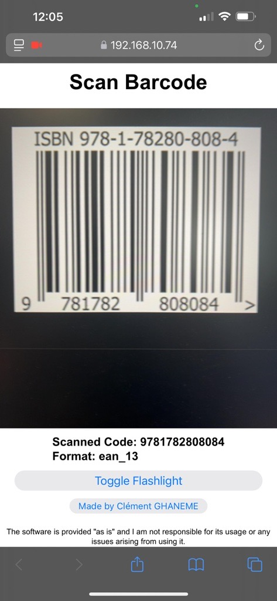

# Bar-Code-Caster Host Application

A Python application that hosts a web server for continuous barcode scanning using mobile or tablet devices. This application allows users to scan barcodes directly from a mobile device’s camera and transmits the scanned data to the host machine for either virtual keyboard input or CSV file output. This is useful for inventory tracking, asset management, and any situation requiring quick and reliable barcode scanning across a network.

## Features

- **Web Interface for Scanning**: Accessible from any device on the same network, with a mobile-friendly design.
- **Continuous Scanning Mode**: Detects multiple scans without needing page reloads.
- **Configurable Cooldown Timer**: Prevents duplicate scans by setting a cooldown period.
- **Output Mode Options**: Choose between keyboard emulation or appending data to a CSV file.
- **Real-Time Statistics in GUI**: Displays total scans, last scanned and format, status, and connected users.
- **Self-Signed SSL**: Secure HTTPS connection generated on first use.
- **QR Code Access**: Easily access the server address via QR code displayed in the GUI.
- **User-Friendly GUI**: Tkinter-based GUI with QR code, SSL information.
---

## Installation

### Prerequisites

- Python 3.x
- Network-connected device for scanning on the same network (mobile, tablet, etc.)

### Installation Steps

1. Clone or Download this repository

2. Install dependencies:

   The program will check for required packages (`flask`, `pyautogui`, `pyOpenSSL`, `qrcode`, and `Pillow`) and install them automatically.

4. Run the application:
    ```bash
    python Bar-Code-Caster.py
    ```
   On the first run, SSL certificates will be generated automatically, and the server address and QR code will display in the GUI.

---

## Usage

### Accessing the Scanner

1. **Server Address and QR Code**: The application GUI shows the server address (e.g., `https://<local-ip>:5000`) and a QR code.
2. **Allow Camera Access**: After accessing the page on your mobile device, allow camera access when prompted.
3. **Align Barcode**: Position the barcode within the camera view to scan. The cooldown timer prevents duplicate scans.

### Output Modes

- **Keyboard**: The scanned data will be "typed" on the host machine.
- **CSV File**: Scanned data is appended to `scanned_codes.csv` in the project folder.

---

## GUI Overview

- **Server Status and Connection Info**: Displays the server address, QR code, SSL info, and connected users.
- **Scan Information**: Shows the last scanned code, format, and total number of scans.
- **Options**: Configure output mode (keyboard or CSV) and set the cooldown time between scans.
- **"Made by Clément GHANEME" Button**: Links to [https://clement.business](https://clement.business).
- **Disclaimer**: Usage and responsibility disclaimer.

---

## Screenshot - Application GUI


## Screenshot - CSV Formatting


## Screenshot - Mobile Scanning Page IOS



*Images are located in the `assets` folder for this README.*

---

## Notes

- **Permissions**: Ensure `pyautogui` has necessary accessibility permissions, especially on macOS.
- **Browser Compatibility**: Use Chrome, Safari or Firefox on the scanning device.
- **Security Warnings**: When accessing from a mobile device, you may need to accept the SSL certificate due to it being self-signed.
- **Concurrent Scanning**: Multiple users can scan barcodes at the same time from different devices, with all data recorded in the same CSV file in real time.
- **Firewall Notice**: When launching the application for the first time, you may see a firewall prompt (e.g., on Windows). Be sure to allow access for the app to function correctly on your network.

---

## Credits

- **Developed by**: Clément GHANEME
- **Contact**: [https://clement.business](https://clement.business)

